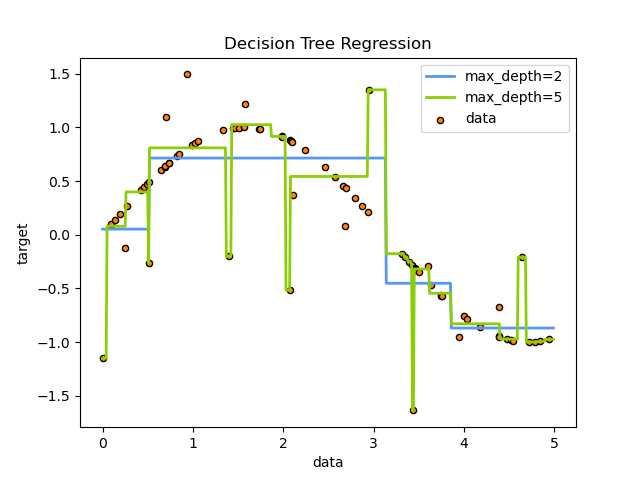

# 1. 10. 의사결정트리

**의사결정트리 (Decision Trees, DTs)**는 분류와 회귀를 위해 사용하는 비모수(非母數, Non-parametric) 지도학습 방법이다. DT의 목적은, 데이터 피쳐로부터 도출된 간단한 의사결정 규칙을 학습하여 **목표 변수의 값을 예측**하는 것이다. 트리는 조각 상수 근사치(piecewise constant approximation)이라 할 수 있다.

※ piecewise constant approximation이 무슨 의미인지 잘 모르겠음

예를 들어, 아래의 예제에서 의사결정 트리는 if-then-else 규칙 세트를 이용하여 사인 곡선을 근사하기 위해 데이터를 학습한다. 트리가 깊어질수록, 모델은 더 핏(fit)해지고 의사결정 규칙은 복잡해진다.

의사결정트리의 장점으로는 다음과 같은 것들이 있다.

- 이해하고 해석하기가 쉽다. 트리가 시각화 될 수 있다.
- 다른 기술들은 정규화(normalization), 가변수(dummy variable) 생성, 공백값 제거 등이 필요한 반면, 의사결정트리는 데이터 준비가 적게 필요하다. 하지만 **DT**는 결측값을 지원하지 않는다.
- 의사결정트리를 사용하는 비용(데이터 예측)은 트리를 학습하는데 사용된 데이터 포인트(?) 갯수에 로그를 씌운 값이다.
- 다른 기술들이 일반적으로 한 가지 유형의 변수만 있는 데이터셋 분석에 특화되어 있는 반면, 의사결정트리는 숫자형(numerical) 변수와 범주형(categorical) 변수를 모두 다룰 수 있다 (단, scikit-learn 모듈은 현재 범주형 변수를 지원하지 않음).
- multi-output 문제를 해결할 수 있다.
- 화이트박스 모델을 사용한다. 모델에서 어떤 상황(결과)를 관찰한 경우, 그 상황에 대한 조건은 부울 논리로 쉽게 설명할 수 있다. 반대로, 블랙박스 모델(예: 인공 신경망)에서는 결과를 해석하기가 더 어려울 수 있다.
- 통계 테스트를 사용한 모델 검증을 통해 신뢰성을 설명할 수 있다.
- 데이터가 생성된 실제 모델에 의해 가정이 다소 위반되더라도 성능이 우수하다. ⇒ 무슨말인지 모르겠음

의사결정트리의 단점은 다음과 같다.

- 데이터를 잘 일반화하지 않는, 지나치게 복잡한 트리가 생성될 수 있다. 이를 과적합(overfitting)이라 한다. 과적합 방지를 위해 가지치기(pruning), 리프 노드에 필요한 최소 샘플 수 설정, 또는 최대 깊이 설정과 같은 방법들이 사용되어야 한다.
- 데이터의 작은 변화만으로도 완전히 다른 형태의 트리가 생성될 수 있으므로, 불안정하다고 할 수 있다. 앙상블 내에서 의사결정 트리를 사용함으로써 이러한 문제를 완화할 수 있다.
- 위의 그림에서 볼 수 있듯, 의사결정 트리의 예측값은 매끄럽거나 연속적이지 않은, piecewise constant approximations 이다. 따라서, [외삽법(外揷法)](https://terms.naver.com/entry.naver?docId=1102680&cid=40942&categoryId=32217)에 유용하지 않다.
- 최적의 의사결정 트리를 학습하는 문제는 **NP-Complete** 문제로 알려져 있다. 따라서, 실용적인 의사결정 트리 학습 알고리즘은 각 노드에서 국부적으로 최적의 결정을 내리는 greedy 알고리즘과 같은 heuristic 알고리즘에 기반하고 있다. heuristic 알고리즘은 전역적으로 최적의 의사결정 트리를 생성한다고 보장할 수 없다. 이와 같은 문제는 피쳐와 샘플이 무작위로 샘플링되는 앙상블 학습기에서 여러 트리를 훈련하여 완화할 수 있다.
- XOR, 패리티, 멀티플렉서와 같이 의사결정 트리가 학습하기가 어려운 개념들이 존재한다.
- 특정 클래스가 지배적이 되는, 편향된 트리가 생성될 수 있다. 따라서, 의사결정트리를 학습시키기 전에 데이터셋의 균형을 맞추는 것이 좋다.

# 1.10.1 분류(Classification)
